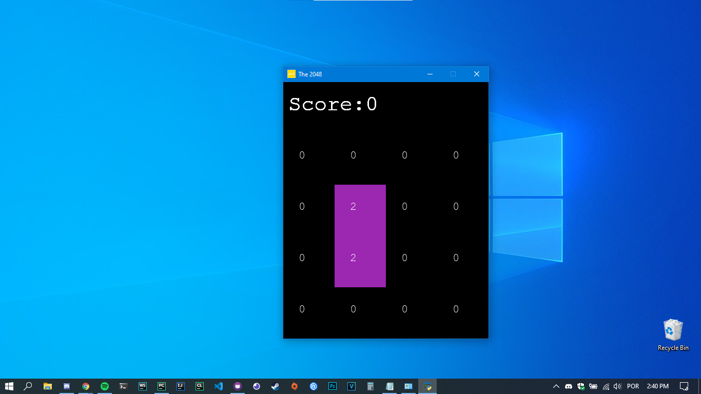
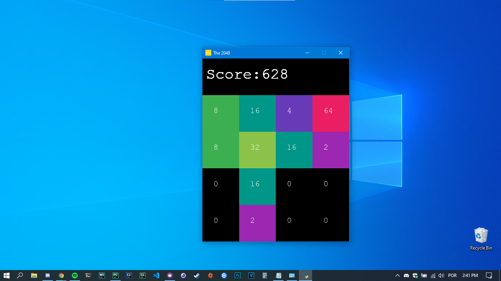
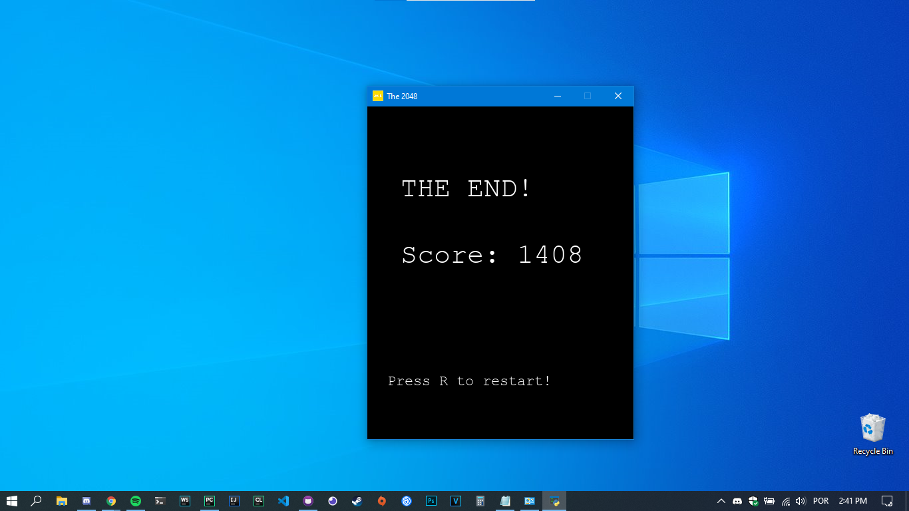

# Introduction
This game had been developed as a Object Oriented Programming homework at UENP.

The objective of the game is to slide numbered tiles on a board to combine them
to create a tile with the number 2048; however, it's also possible to continue
the gameplay after reaching the goal, creating tiles with larger numbers.

# How to execute

- Install PyGame:
> `` pip install pygame ``

- Run script:
> `` cd src/ ``

> `` python main.py ``

# Samples of its screens
### How it starts

### During gameplay

### Game over display

